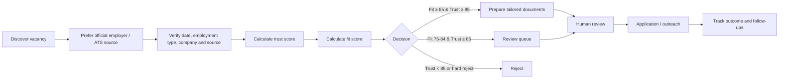
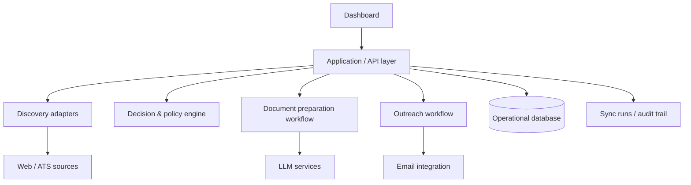

# Agentic AI Job Hunt OS — Public Portfolio Edition

A privacy-safe portfolio case study showing how a **Business Analyst can translate an ambiguous job-search problem into governed decision rules, workflow automation, data structures, and human-in-the-loop controls**.

> **Important:** This repository is a sanitized showcase, not the production system. It contains mock data, selected implementation patterns, and documentation. Production credentials, personal data, OAuth tokens, generated resumes, contact research, application history, and private integrations are intentionally excluded.

## What this project demonstrates

- Requirements elicitation and conversion into explicit business rules
- Job-source discovery and canonical-source preference
- Fit scoring and trust scoring as separate decision dimensions
- Human-in-the-loop controls for outreach and applications
- Resume-generation guardrails based on evidence and job-description completeness
- Workflow states, exception handling, source-health diagnostics, and auditability
- Security and privacy-by-design for AI-assisted automation

## Business problem

Job searching becomes difficult to manage when discovery, verification, tailoring, referrals, follow-ups, and application tracking happen in separate tools. The goal of the Job Hunt OS is to create one governed workflow that helps a candidate identify strong opportunities quickly **without automating high-risk actions blindly**.

The portfolio version focuses on the decision model rather than private production integrations.

## Core decision model

A vacancy is evaluated on two independent scores:

- **Fit Score** — how strongly the role aligns with the target profile and role families.
- **Trust Score** — how reliable and verifiable the vacancy appears based on source quality and evidence.

Illustrative public-portfolio rules (not a disclosure of the private candidate profile or production compensation policy):

| Condition | Decision |
| --- | --- |
| Fit ≥ 85 and Trust ≥ 85 | Eligible for document preparation |
| Fit 75–84 and Trust ≥ 85 | Review queue |
| Trust < 85 | Reject / do not pursue |
| Contract role | Reject |
| Job age > 36 hours | Reject |
| Posting date cannot be verified | Reject |
| Onsite role | Preferred |
| Hybrid/remote | Pursue only when compensation threshold is met |

These values are represented as policy inputs in the public decision engine so the logic is inspectable and testable.

## Workflow



## Human-in-the-loop controls

The production concept deliberately keeps irreversible or reputation-sensitive actions under user control. First-contact outreach, LinkedIn actions, and final applications require review/approval. AI can support research, drafting, prioritization, and document preparation, but it should not invent resume facts or silently send outreach.

## Architecture concept



See [docs/ARCHITECTURE.md](docs/ARCHITECTURE.md) for the portfolio architecture and [docs/PRODUCTION_VS_PUBLIC.md](docs/PRODUCTION_VS_PUBLIC.md) for what is intentionally omitted.

## Repository structure

```text
.
├── demo/                       # Browser-based mock dashboard
├── src/core/                   # Sanitized decision and source-health logic
├── src/data/                   # Mock vacancies only
├── tests/                      # Executable business-rule tests
├── docs/                       # BA case study and solution documentation
├── SECURITY.md                 # Public security posture
├── PUBLICATION_CHECKLIST.md    # Before pushing to a public GitHub repo
└── README.md
```

## Run the showcase locally

No third-party packages are required.

```bash
npm test
npm run demo
```

Then open `http://localhost:8080/demo/`.

If Python is not installed, any static web server can serve the repository root.

## Business Analyst artefacts

The documentation set includes:

- [BA Case Study](docs/BA_CASE_STUDY.md)
- [Business Rules](docs/BUSINESS_RULES.md)
- [Requirements Traceability Matrix](docs/REQUIREMENTS_TRACEABILITY_MATRIX.md)
- [Architecture](docs/ARCHITECTURE.md)
- [Data Model](docs/DATA_MODEL.md)
- [Security & Governance](docs/SECURITY_GOVERNANCE.md)
- [Test Scenarios](docs/TEST_SCENARIOS.md)

## Production technology context

The private production implementation uses a web application architecture with TypeScript/Next.js, Supabase/PostgreSQL, OpenAI-powered analysis/discovery, Gmail OAuth integration, scheduled synchronization, and controlled document/outreach workflows. This public repository demonstrates the design and policy layer without publishing private production code or credentials.

## Privacy statement

All names, companies, job descriptions, compensation values, scores, and records in this repository are **fictional demo data**. No real recruiter/contact dataset or candidate application history is included.

## License

MIT. See [LICENSE](LICENSE).
