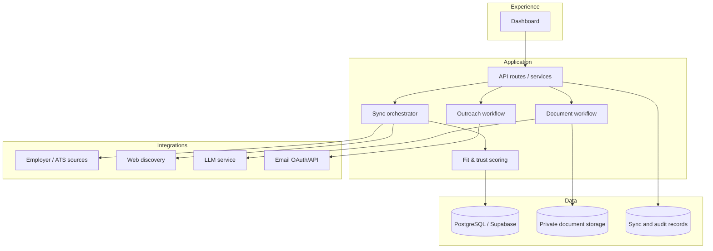

# Architecture

## Production concept

The private system is designed as a server-side web application with a dashboard, API layer, persistence, source adapters, LLM-assisted workflows, email integration, and scheduled synchronization.

## Public repository boundary

The public repository contains only:

- deterministic policy examples,
- source-health error-handling patterns,
- a resume-evidence guardrail example,
- fictional sample jobs,
- an offline dashboard demo,
- BA documentation and test scenarios.

It deliberately does **not** include production integration code, authentication, secret configuration, OAuth tokens, candidate source documents, generated resumes, contact research, or the operational database.
