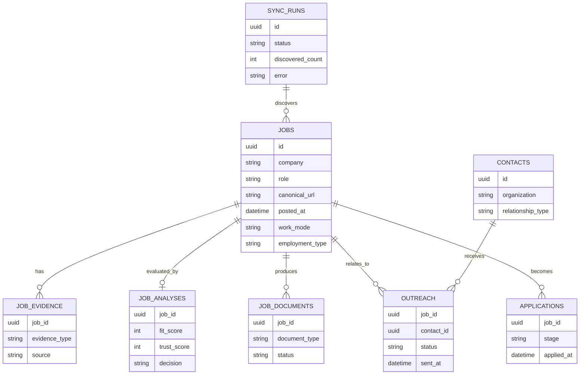

# Data Model

The production concept separates operational entities so that source evidence, scoring, documents, outreach, and applications can be audited independently.

The public demo does not connect to this model; it uses in-memory fictional records only.
